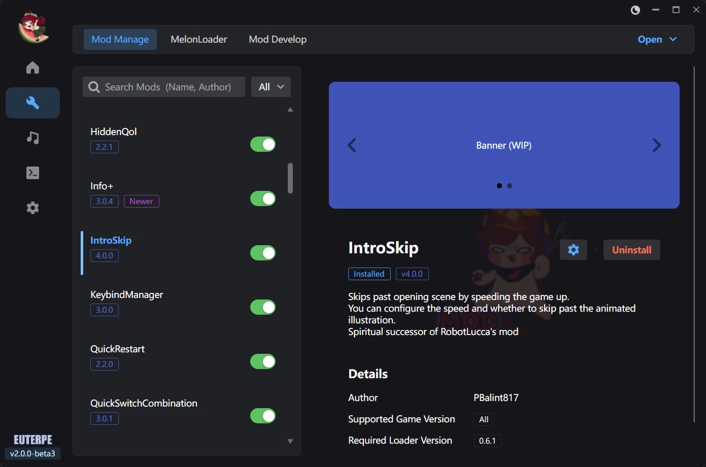

English | [简体中文](README.zh-CN.md)

  
  <h1>Euterpe</h1>
  
<strong>A modern platform to discover, share, and manage Muse Dash mods.</strong>

  

## 📥 Download

- **Release:** The stable build for most users.
  [Go to GitHub Releases](https://github.com/Euterpe-org/Euterpe/releases)
- **CI:** For specific commits only. Open Actions, pick the workflow run, then download from **Artifacts**.
  [Open GitHub Actions](https://github.com/Euterpe-org/Euterpe/actions)

## 🍉 Euterpe Hub

The heart of the ecosystem — browse every mod anytime.
Developers can create accounts to upload and manage mods in one click.

## 💬 Discord

Join the official Discord server for updates, support, and community.

## 🤝 Contributors

## 📜 License

This project is licensed under the [GNU General Public License v3.0](LICENSE).

<b>Third-Party Notices</b>

### Libraries

| Library                                                                          | License                                                                         |
|----------------------------------------------------------------------------------|---------------------------------------------------------------------------------|
| [AsmResolver](https://github.com/Washi1337/AsmResolver)                          | [MIT](https://github.com/Washi1337/AsmResolver/blob/master/LICENSE.md)          |
| [AssetsTools.NET](https://github.com/nesrak1/AssetsTools.NET)                    | [MIT](https://github.com/nesrak1/AssetsTools.NET/blob/master/LICENSE)           |
| [AsyncAwaitBestPractices](https://github.com/brminnick/AsyncAwaitBestPractices)  | [MIT](https://github.com/brminnick/AsyncAwaitBestPractices/blob/main/LICENSE)   |
| [Autofac](https://github.com/autofac/Autofac)                                    | [MIT](https://github.com/autofac/Autofac/blob/develop/LICENSE)                  |
| [Avalonia](https://github.com/AvaloniaUI/Avalonia)                               | [MIT](https://github.com/AvaloniaUI/Avalonia/blob/master/licence.md)            |
| [CliWrap](https://github.com/Tyrrrz/CliWrap)                                     | [MIT](https://github.com/Tyrrrz/CliWrap/blob/master/License.txt)                |
| [CommunityToolkit.Mvvm](https://github.com/CommunityToolkit/dotnet)              | [MIT](https://github.com/CommunityToolkit/dotnet/blob/main/License.md)          |
| [ConsoleAppFramework](https://github.com/Cysharp/ConsoleAppFramework)            | [MIT](https://github.com/Cysharp/ConsoleAppFramework/blob/master/LICENSE)       |
| [Downloader](https://github.com/bezzad/Downloader)                               | [MIT](https://github.com/bezzad/Downloader/blob/master/LICENSE)                 |
| [DynamicData](https://github.com/reactivemarbles/DynamicData)                    | [MIT](https://github.com/reactivemarbles/DynamicData/blob/main/LICENSE)         |
| [HotAvalonia](https://github.com/Kira-NT/HotAvalonia)                            | [MIT](https://github.com/Kira-NT/HotAvalonia/blob/master/LICENSE)               |
| [Irihi.Ursa](https://github.com/irihitech/Ursa.Avalonia)                         | [MIT](https://github.com/irihitech/Ursa.Avalonia/blob/main/LICENSE)             |
| [JetBrains.Annotations](https://github.com/JetBrains/JetBrains.Annotations)      | [MIT](https://github.com/JetBrains/JetBrains.Annotations/blob/main/license.md)  |
| [ObservableCollections](https://github.com/Cysharp/ObservableCollections)        | [MIT](https://github.com/Cysharp/ObservableCollections/blob/master/LICENSE)     |
| [R3](https://github.com/Cysharp/R3)                                              | [MIT](https://github.com/Cysharp/R3/blob/main/LICENSE)                          |
| [ResXLocalize.Avalonia](https://www.nuget.org/packages/ResXLocalize.Avalonia.R3) | [MIT](https://licenses.nuget.org/MIT)                                           |
| [Riok.Mapperly](https://github.com/riok/mapperly)                                | [Apache-2.0](https://github.com/riok/mapperly/blob/main/LICENSE)                |
| [Semi.Avalonia](https://github.com/irihitech/Semi.Avalonia)                      | [MIT](https://github.com/irihitech/Semi.Avalonia/blob/main/LICENSE)             |
| [Semver](https://github.com/WalkerCodeRanger/semver)                             | [MIT](https://github.com/WalkerCodeRanger/semver/blob/master/LICENSE)           |
| [System.ServiceModel.Syndication](https://github.com/dotnet/wcf)                 | [MIT](https://github.com/dotnet/wcf/blob/main/LICENSE.TXT)                      |
| [ValveKeyValue](https://github.com/ValveResourceFormat/ValveKeyValue)            | [MIT](https://github.com/ValveResourceFormat/ValveKeyValue/blob/master/LICENSE) |
| [ZLogger](https://github.com/Cysharp/ZLogger)                                    | [MIT](https://github.com/Cysharp/ZLogger/blob/master/LICENSE)                   |

### Fonts

| Font                                   | License                                                              |
|----------------------------------------|----------------------------------------------------------------------|
| [Inter](https://github.com/rsms/inter) | [SIL OFL 1.1](https://github.com/rsms/inter/blob/master/LICENSE.txt) |

### Tools

| Tool                                                   | License                                                                      |
|--------------------------------------------------------|------------------------------------------------------------------------------|
| [MelonLoader](https://github.com/LavaGang/MelonLoader) | [Apache-2.0](https://github.com/LavaGang/MelonLoader/blob/master/LICENSE.md) |

