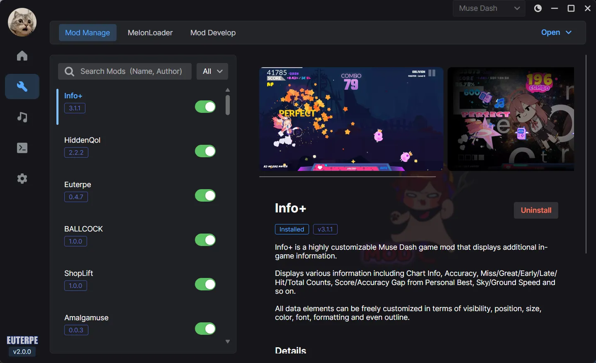
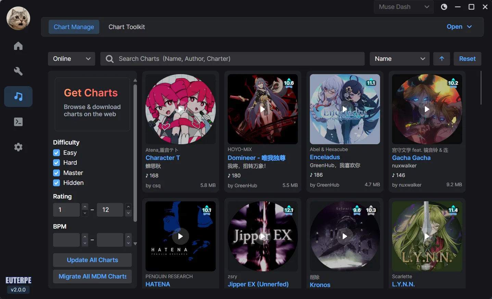

[English](README.md) | 简体中文

  
  <h1>Euterpe</h1>
  
<strong>发现、分享和管理喵斯快跑谱面与模组的现代化平台</strong>

 

  

  

 

## 📥 下载

- **正式版：** 适合大多数用户的稳定版本。
  [前往 GitHub Releases](https://github.com/Euterpe-org/Euterpe/releases)
- **开发版：** 每天从 `dev` 分支自动构建，包含最新功能，但可能不稳定。
  [下载开发版](https://github.com/Euterpe-org/Euterpe/releases/tag/nightly)

 

## 🎹 Euterpe Hub

生态系统的核心 - 玩家随时浏览所有谱面与模组；谱师与开发者一键上传和管理谱面与模组。
创建你的账号，加入 Euterpe 大家庭！

 

## 💬 Discord

加入官方 Discord 服务器，获取更新、支持和社区交流。

 

## 🤝 贡献者

 

## 📜 许可证

本项目基于 [GNU 通用公共许可证 v3.0](LICENSE) 开源。

<b>第三方声明</b>

 

### 库

| 库 | 许可证 |
|---|---|
| [AsmResolver](https://github.com/Washi1337/AsmResolver) | [MIT](https://github.com/Washi1337/AsmResolver/blob/master/LICENSE.md) |
| [AssetsTools.NET](https://github.com/nesrak1/AssetsTools.NET) | [MIT](https://github.com/nesrak1/AssetsTools.NET/blob/master/LICENSE) |
| [AsyncAwaitBestPractices](https://github.com/brminnick/AsyncAwaitBestPractices) | [MIT](https://github.com/brminnick/AsyncAwaitBestPractices/blob/main/LICENSE) |
| [Autofac](https://github.com/autofac/Autofac) | [MIT](https://github.com/autofac/Autofac/blob/develop/LICENSE) |
| [Avalonia](https://github.com/AvaloniaUI/Avalonia) | [MIT](https://github.com/AvaloniaUI/Avalonia/blob/master/licence.md) |
| [Avalonia.Labs](https://github.com/AvaloniaUI/Avalonia.Labs) | [MIT](https://github.com/AvaloniaUI/Avalonia.Labs/blob/main/LICENSE) |
| [CliWrap](https://github.com/Tyrrrz/CliWrap) | [MIT](https://github.com/Tyrrrz/CliWrap/blob/master/License.txt) |
| [CommunityToolkit.Mvvm](https://github.com/CommunityToolkit/dotnet) | [MIT](https://github.com/CommunityToolkit/dotnet/blob/main/License.md) |
| [ConsoleAppFramework](https://github.com/Cysharp/ConsoleAppFramework) | [MIT](https://github.com/Cysharp/ConsoleAppFramework/blob/master/LICENSE) |
| [dotNext](https://github.com/dotnet/dotNext) | [MIT](https://github.com/dotnet/dotNext/blob/master/LICENSE) |
| [Downloader](https://github.com/bezzad/Downloader) | [MIT](https://github.com/bezzad/Downloader/blob/master/LICENSE) |
| [DynamicData](https://github.com/reactiveui/DynamicData) | [MIT](https://github.com/reactiveui/DynamicData/blob/main/LICENSE.md) |
| [Irihi.Ursa](https://github.com/irihitech/Ursa.Avalonia) | [MIT](https://github.com/irihitech/Ursa.Avalonia/blob/main/LICENSE) |
| [JetBrains.Annotations](https://github.com/JetBrains/JetBrains.Annotations) | [MIT](https://github.com/JetBrains/JetBrains.Annotations/blob/main/license.md) |
| [Nerdbank.MessagePack](https://github.com/AArnott/Nerdbank.MessagePack) | [MIT](https://github.com/AArnott/Nerdbank.MessagePack/blob/main/LICENSE) |
| [NetEscapades.EnumGenerators](https://github.com/andrewlock/NetEscapades.EnumGenerators) | [MIT](https://github.com/andrewlock/NetEscapades.EnumGenerators/blob/main/LICENSE) |
| [NLog](https://github.com/NLog/NLog) | [BSD-3-Clause](https://github.com/NLog/NLog/blob/master/LICENSE.txt) |
| [NLog.Extensions.Logging](https://github.com/NLog/NLog.Extensions.Logging) | [BSD-2-Clause](https://github.com/NLog/NLog.Extensions.Logging/blob/master/LICENSE) |
| [ObservableCollections](https://github.com/Cysharp/ObservableCollections) | [MIT](https://github.com/Cysharp/ObservableCollections/blob/master/LICENSE) |
| [R3](https://github.com/Cysharp/R3) | [MIT](https://github.com/Cysharp/R3/blob/main/LICENSE) |
| [Refit](https://github.com/reactiveui/refit) | [MIT](https://github.com/reactiveui/refit/blob/main/LICENSE) |
| [ResXLocalize.Avalonia](https://github.com/lxymahatma/ResXLocalize.Avalonia) | [MIT](https://github.com/lxymahatma/ResXLocalize.Avalonia/blob/master/LICENSE.txt) |
| [Riok.Mapperly](https://github.com/riok/mapperly) | [Apache-2.0](https://github.com/riok/mapperly/blob/main/LICENSE) |
| [Semi.Avalonia](https://github.com/irihitech/Semi.Avalonia) | [MIT](https://github.com/irihitech/Semi.Avalonia/blob/main/LICENSE) |
| [Semver](https://github.com/WalkerCodeRanger/semver) | [MIT](https://github.com/WalkerCodeRanger/semver/blob/master/LICENSE) |
| [SoundFlow](https://github.com/LSXPrime/SoundFlow) | [MIT](https://github.com/LSXPrime/SoundFlow/blob/master/LICENSE.md) |
| [Tmds.DBus](https://github.com/tmds/Tmds.DBus) | [MIT](https://github.com/tmds/Tmds.DBus/blob/main/LICENSE) |
| [ValveKeyValue](https://github.com/ValveResourceFormat/ValveKeyValue) | [MIT](https://github.com/ValveResourceFormat/ValveKeyValue/blob/master/LICENSE) |
| [Velopack](https://github.com/velopack/velopack) | [MIT](https://github.com/velopack/velopack/blob/develop/LICENSE) |
| [Xaml.Behaviors](https://github.com/wieslawsoltes/Xaml.Behaviors) | [MIT](https://github.com/wieslawsoltes/Xaml.Behaviors/blob/master/LICENSE.TXT) |
| [XenoAtom.Logging](https://github.com/XenoAtom/XenoAtom.Logging) | [BSD-2-Clause](https://github.com/XenoAtom/XenoAtom.Logging/blob/main/license.txt) |

### 字体

| 字体 | 许可证 |
|-----|--------|
| [Inter](https://github.com/rsms/inter) | [SIL OFL 1.1](https://github.com/rsms/inter/blob/master/LICENSE.txt) |

### 工具

| 工具 | 许可证 |
|-----|--------|
| [MelonLoader](https://github.com/LavaGang/MelonLoader) | [Apache-2.0](https://github.com/LavaGang/MelonLoader/blob/master/LICENSE.md) |

